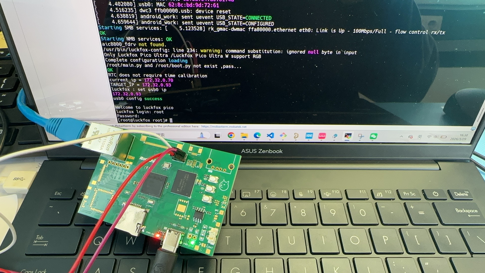

# RV1106G3 DevKit

This repository showcases a custom-built **RV1106G3 development kit**, fully hand-soldered.

## 🔧 Status

The following components have been tested and verified:

- ✅ Power supply  
- ✅ eMMC (8GB)  
- ✅ Ethernet (100 Mbps)  
- ✅ SD card  

> ⚠️ Note: Other peripherals are not yet fully tested.

## 📸 Hardware Preview

  

